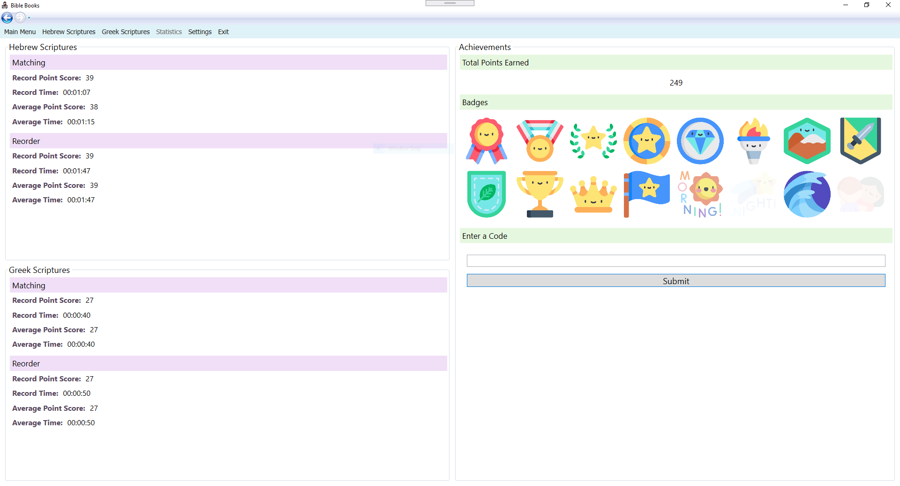
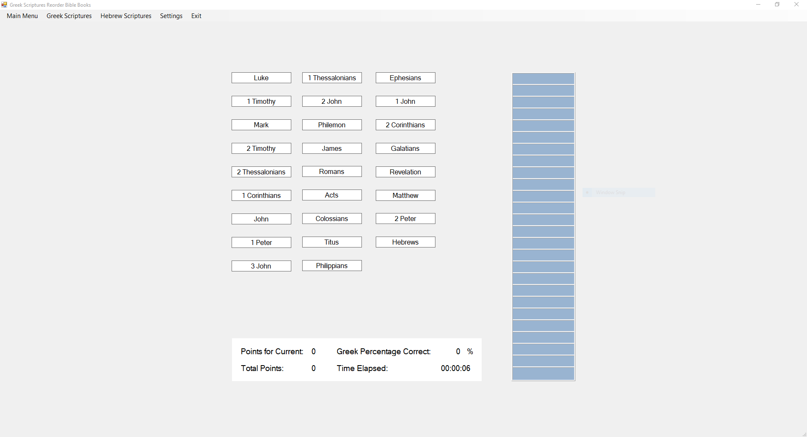

# bibleBooksChineseGame
A matching game for Chinese and English Bible books

## Sections:  
[Installation](#installation)  
[Sample Screenshots](#sample-screenshots)  
[Features](#features)  
[Zoom Sharing](#zoom-sharing)  
[WinForms (Old Design)](#winforms-old-design)  
[Credits](#credits)

***
## Installation

To install, download the latest release [**here**](https://github.com/kezizhou/bibleBooksChineseGame/releases/latest).
Download and run bibleBooksGameSetup.exe to install bibleBooksChineseGame onto your computer. You may choose to uninstall at any time by uninstalling from your programs list. The application will automatically check for new updates every time it is started, or you can check manually in the settings page.

### System Requirements:
Windows: Runs on Microsoft .NET Framework 4.6.1

### Common Installation Issues:

#### Administrator has blocked install
You may see an error like this that blocks the install:  

If you are the administrator account and are able to change computer settings:  
* Search for "Registry Editor" or "regedit" on your computer.  
* Find the Computer\HKEY_LOCAL_MACHINE\SOFTWARE\Microsoft\.NETFramework\Security\TrustManager\PromptingLevel security settings as shown below.  
* Ensure that "Internet" is set to "Enabled". If it is disabled, double click "Internet" and change the data to be set to "Enabled".  
  
* Note: Changing this setting will still allow you to decide whether or not to install applications from unknown publishers. You will still be warned, but you will be allowed to install if you choose to.  

When these steps have been completed, you should see a window like this on the install:  

**[Back to Top](#bibleBooksChineseGame)**

***
## Sample Screenshots

Select User  
  
***

New User  
   
***

Main Menu  
  
***

Hebrew Scriptures Match Chinese to English  
  
***

Hebrew Scriptures Reorder Books  
  
***

Greek Scriptures Match Chinese to English  
  
***

Greek Scriptures Reorder Books  
  
***

Statistics  
  
***

Settings  

**[Back to Top](#bibleBooksChineseGame)**

***
### Features
* Language setting to switch interface and games from English to Chinese and vice versa
* Matching games for Hebrew and Greek Scriptures with Chinese and English
* Reorder Bible books games for Hebrew and Greek Scriptures
* Opportunity to earn badges during play
* Enter codes to earn more badges
* Statistics page tracks average and record scores and times
* Turn on or off audio pronunciation for Bible books
* Multiple users per device
* Responsive design for different screen sizes

***
### Zoom Sharing
To share this application on Zoom and allow another person to control the screen through Remote Control, you will need to install [**this**](https://github.com/joshuatz/right-click-and-drag/releases/download/v0.1.0/right-click-and-drag.exe) application. The Right Click and Drag application was created by another GitHub user, and uses HotKey operations to turn all right clicks into a left click and drag operation. On Zoom, holding down indicates a right click, so this application will simulate a dragging motion on the host application. To use, check the checkbox to enable the application to start. When finished sharing on Zoom, uncheck the enabled box to end use.

**[Back to Top](#bibleBooksChineseGame)**

***
### WinForms (Old Design)
This application was originally created using WinForms, and then changed to use WPF. To see the original WinForms branch, click [here](https://github.com/kezizhou/bibleBooksChineseGame/tree/winforms). The following are screenshots of the old design:  

WinForms Hebrew Match

***

WinForms Greek Reorder

***
### Credits
* Code
  * All code was written by GitHub user kezizhou.
* Application Icon "applicationBook.ico": 
  * Creator: Sumit Saengthong
  * Source: https://icon-icons.com/icon/student-pupil-disciple-follower-adherent-apostle/146774
  * This icon was not changed in any format.
* Congratulations image on completion "congrats.png":
  * Icon made by Flat Icons from www.flaticon.com
* Main Menu image "mainMenu.jpg":
  * Photo by [Carolinie Cavalli](https://unsplash.com/@caroliniecavalli) on [Unsplash](https://unsplash.com/)
* Main Menu Book Icon:
  * Icon made by Good Ware from www.flaticon.com
* Help Back and Next Page Icons:
  * Icons made by Roundicons from www.flaticon.com
* New user message box image "newUser.png":
  * Icon made by Smashicons from www.flaticon.com
* Achievement Badges
  * Icons made by photo3idea_studio from www.flaticon.com
* Pause Button Icon
  * Icon made by Pixelmeetup from www.flaticon.com
* Icons made by Freepik from www.flaticon.com:
  * Achievement Badges
  * Delete User Trash Can Icon
  * Confirm Delete User Icon
  * User Profile Icons
  * Record Score Icon
  * Record Time Icon
