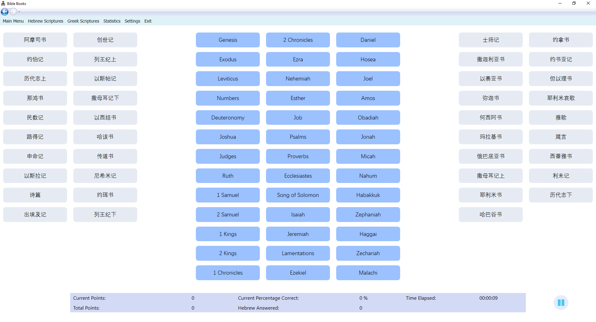

# bibleBooksChineseGame
A matching game for Chinese and English Bible books

## Sections:  
[Installation](#installation)  
[Sample Screenshots](#sample-screenshots)  
[Zoom Sharing](#zoom-sharing)  
[Credits](#credits)

***
## Installation

To install, download the latest release [**here**](https://github.com/kezizhou/bibleBooksChineseGame/releases).
Download and run setup.exe to install bibleBooksChineseGame onto your computer. You may choose to uninstall at any time by uninstalling from your programs list. The application will automatically check for new updates every time it is started.

### Common Installation Issues:

#### Administrator has blocked install
You may see an error like this that blocks the install:  

If you are the administrator account and are able to change computer settings:  
* Search for "Registry Editor" or "regedit" on your computer.  
* Find the Computer\HKEY_LOCAL_MACHINE\SOFTWARE\Microsoft\.NETFramework\Security\TrustManager\PromptingLevel security settings as shown below.  
* Ensure that "Internet" is set to "Enabled". If it is disabled, double click "Internet" and change the data to be set to "Enabled".  
  
* Note: Changing this setting will still allow you to decide whether or not to install applications from unknown publishers. You will still be warned, but you will be allowed to install if you choose to.  

When these steps have been completed, you should see a window like this on the install:  

**[Back to Top](#bibleBooksChineseGame)**

***
## Sample Screenshots

  

  

  

**[Back to Top](#bibleBooksChineseGame)**

***
### Zoom Sharing
To share this application on Zoom and allow another person to control the screen through Remote Control, you will need to install [**this**](https://github.com/joshuatz/right-click-and-drag/releases/download/v0.1.0/right-click-and-drag.exe) application. The Right Click and Drag application was created by another GitHub user, and uses HotKey operations to turn all right clicks into a left click and drag operation. On Zoom, holding down indicates a right click, so this application will simulate a dragging motion on the host application. To use, check the checkbox to enable the application to start. When finished sharing on Zoom, uncheck the enabled box to end use.

**[Back to Top](#bibleBooksChineseGame)**

***
### Credits
* Code
  * All code was written by GitHub user kezizhou.
* Application Icon "applicationBook.ico": 
  * Creator: Sumit Saengthong
  * Source: https://icon-icons.com/icon/student-pupil-disciple-follower-adherent-apostle/146774
  * This icon was not changed in any format.
* Congratulations image on completion "congrats.png":
  * Icon made by Flat Icons from www.flaticon.com
* Main Menu image "book.jpg":
  * Photo by [Aaron Burden](https://unsplash.com/@aaronburden) on [Unsplash](https://unsplash.com/)
* New user message box image "newUser.png":
  * Icon made by Smashicons from www.flaticon.com
* Achievement Badges
  * Icons made by Freepik from www.flaticon.com
  * Icons made by photo3idea_studio from www.flaticon.com